**Node Project Adam NASSIR CDOF5** 

**Part 1: The models/tables** 

Users : 

A user needs to register with a Username, an email address and a password. Here, the password can be seen in the database yet my initial desire was to use the “bcrypt“ module to hash the each user’s password so that there would be a layer of security yet when trying to use Angular in conjunction with my backend in NodeJS, there seemed to be a discrepancy between what the user put as their password and what was actually hashed, thus I had to discard this idea for now. The parts of the code that would have been used are still partly present in “UserRoutes” but as comments. 

Decks : 

A user, once logged in, could create decks with a short description  of what they entailed, thus the user would be able to personally manage their deck inventory  (more on that later). 

Flashcards : 

Each deck would have a set of cards assigned to it that could be personally added by the user, both the front content and the back content could be personnalized. 

Tags: 

Tags were added to the flashcards, so that the user could categorize the flashcards in each deck according to their preference. 

Flashcards-Tags : 

A table used to link flashcards with tags, as a flashcard could have multiple tags attached to it and a tag could belong to multiple flashcards at the same time. 

WorkData : 

A table that would track the data of each user for each card, according to their performance  with a certain card, the function  “updateRepetitionData”  in “WorkDataFunc.ts” would return the values of repetition number,  easiness\_factor and interval. Repetition number being the number of times a user has reviewed a flashcard ; easiness\_factor represents how easy or hard a certain flashcard is ; interval represents the recommended  duration between two reviews of a certain flashcard. Thus “updateRepetitionData”  would tell the user when they should  probably review a flashcard next in regards to optimizing  their learning ability. 

**Part 2: What appears when you launch the app** 

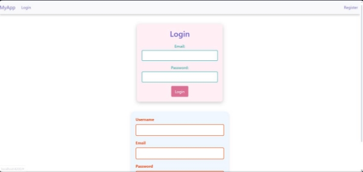

This is the initial page, there you can either click register or login. Clicking register gives this following page : 

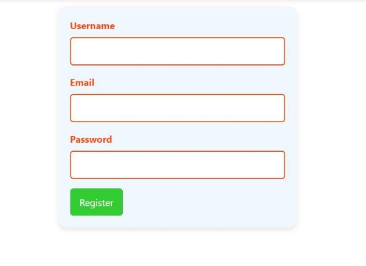

And clicking login gives the following  : 

Once logged in, you arrived at this page : 

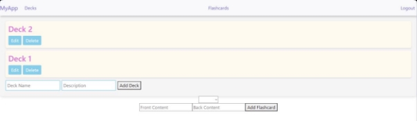

There you can either view your decks, your flashcards in each deck and log out if you desire to do so. 

Decks : 

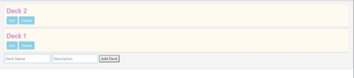

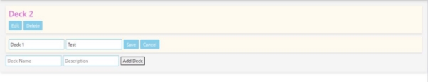

Here, you can create new decks and edit them by changing  their name and description,  you can also delete them if you wish to do so. 

Flashcards : 

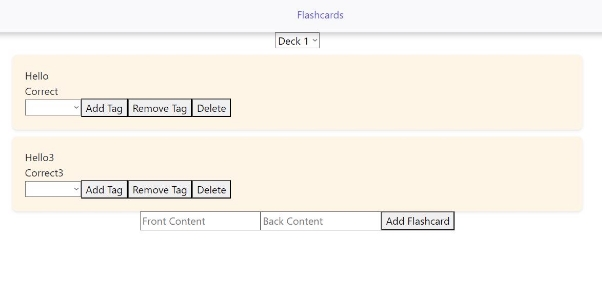

On this page, you can view the flashcards present in each deck, you can see that choosing a deck with no flashcards in it shows nothing. 

You can delete any flashcard from any deck you possess, also, you can add tags to your flashcards, and remove them if you want. 

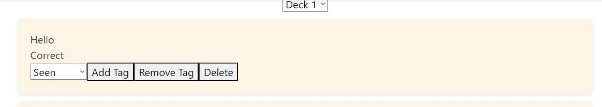

**Part 3: What couldn’t make it to frontend** 

I was able to implement multiple things in the backend part of my work that I either couldn’t implement in my frontend part because of time restrictions or because I couldn’t find how to do it even though  some parts of them are present in the frontend part of things, even though  they technically do no work. 

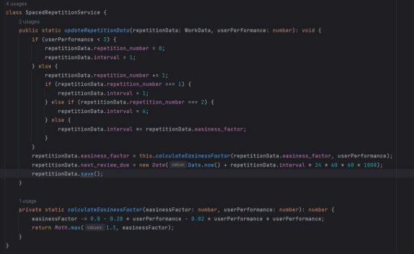

This part was for actually tracing the work of each user corresponding  to their review of each flashcard according to the deck of their choosing,  I used SuperMemo-2  algorithm  as a basis for this function to determine interval from other attributes. 

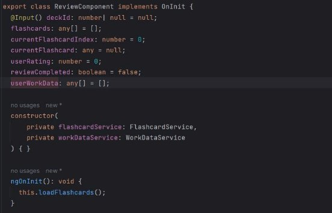

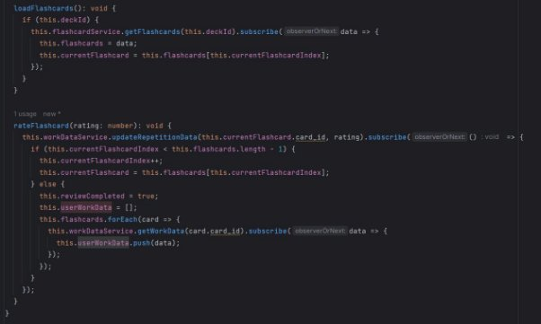

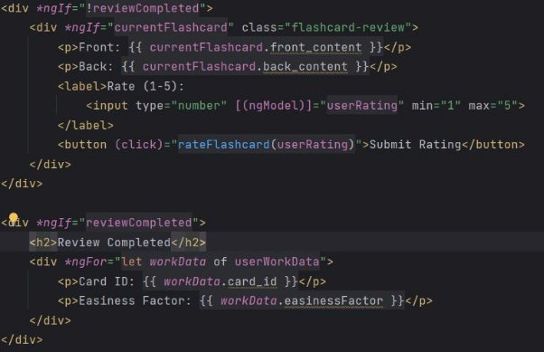

The review part in my frontend  work should have let a user access a page to review a deck of their choosing using a start button that would be next to each deck, yet when trying to actually do that, nothing  appeared and yet no error was being sent my way. I couldn’t understand  why nothing appeared and to this day I still don’t know what the problem was, as you see, once choosing  a deck, a user would rate their performance  from 1 to 5, then the “updateRepetitionData”  would be applied to it and return then, at the end of the deck, the user would get their work data for each flashcard they reviewed 

**Part 4: Issues I had** 

For some weird reason, I wasn’t able to simply use router-outlet  in app.component.html  to link the different routes in app.routes through  app.module  which would have been easier for actually sharing different functions and other methods through  differing components  that would need to work in tandem sometimes. Thus I had to modify each component  as standalone ones, which meant I had to individually  input the routes : 

For example, to link my decks to their review sections (part which I couldn’t make work), I had to create a shared service between the two that would let the app know which deck was selected and if one was selected so that every component  could be affected as a result : hiding everything  but the review section, which is always hiddent until the start button is pressed next to a deck (I erased the button in the deck.component.html  for convenience but it would simply be a start button linked to the “startDeck” method in deck.component.ts) 

The backend part was marginally easier than the frontend  part, honestly Angular is really hard to work with for me personally. 

If you have any questions,  please feel free to contact me at adam.nassirdu.devinci.fr. Thank you ! 
